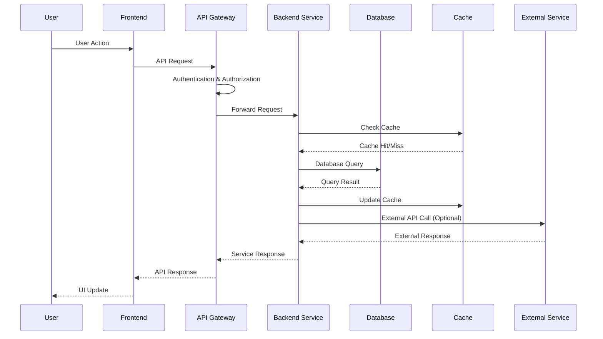

# School Management System Architecture Diagram

```mermaid
graph TB
    %% External Users
    subgraph "External Users"
        S[Students]
        T[Teachers]
        A[Administrators]
        AL[Alumni]
    end

    %% Frontend Layer
    subgraph "Frontend Layer (Next.js)"
        subgraph "Web Application"
            WA[Web App<br/>React + TypeScript]
            PWA[Progressive<br/>Web App]
        end

        subgraph "Mobile Apps (Future)"
            MA[React Native<br/>Mobile App]
        end
    end

    %% API Gateway & Load Balancer
    subgraph "API Gateway & Load Balancer"
        AG[API Gateway<br/>Nginx/Traefik]
        LB[Load Balancer]
    end

    %% Backend Services
    subgraph "Backend Services (Django)"
        subgraph "Core Services"
            UM[User Management<br/>Authentication]
            SM[Student Management]
            TM[Teacher Management]
            AM[Academic Management]
            FM[Finance Management]
        end

        subgraph "Extended Services"
            IMS[Inventory Management]
            EMS[Event Management]
            HMS[Health & Medical]
            DMS[Disciplinary Management]
            SMS[Sports Management]
            CMS[Cafeteria Management]
        end

        subgraph "Supporting Services"
            RS[Reporting Service]
            NS[Notification Service]
            AS[Analytics Service]
            IS[Integration Service]
        end
    end

    %% Data Layer
    subgraph "Data Layer"
        subgraph "Primary Database"
            PDB[(PostgreSQL<br/>Primary DB)]
        end

        subgraph "Analytics Database"
            ADB[(ClickHouse/Redshift<br/>Analytics DB)]
        end

        subgraph "Cache & Session"
            RC[(Redis Cache)]
        end

        subgraph "File Storage"
            S3[(AWS S3 / MinIO<br/>File Storage)]
        end
    end

    %% Integration Layer
    subgraph "Integration Layer"
        subgraph "Payment Gateways"
            RP[Razorpay]
            ST[Stripe]
            PP[PayPal]
        end

        subgraph "Communication"
            TW[Twilio SMS]
            SG[SendGrid Email]
            FB[Firebase Push]
        end

        subgraph "External Systems"
            ZM[Zoom Integration]
            GS[Google Services]
            MS[Microsoft 365]
        end
    end

    %% Infrastructure
    subgraph "Infrastructure"
        subgraph "Cloud Platform"
            AWS[AWS/GCP/Azure]
        end

        subgraph "Containers & Orchestration"
            DC[Docker Containers]
            K8S[Kubernetes<br/>Orchestration]
        end

        subgraph "CI/CD & DevOps"
            GH[GitHub Actions]
            CD[Continuous<br/>Deployment]
            MON[Monitoring<br/>Prometheus/Grafana]
        end
    end

    %% Connections
    S --> WA
    T --> WA
    A --> WA
    AL --> WA

    WA --> AG
    PWA --> AG
    MA --> AG

    AG --> LB
    LB --> UM
    LB --> SM
    LB --> TM
    LB --> AM
    LB --> FM
    LB --> IMS
    LB --> EMS
    LB --> HMS
    LB --> DMS
    LB --> SMS
    LB --> CMS
    LB --> RS
    LB --> NS
    LB --> AS
    LB --> IS

    UM --> PDB
    SM --> PDB
    TM --> PDB
    AM --> PDB
    FM --> PDB
    IMS --> PDB
    EMS --> PDB
    HMS --> PDB
    DMS --> PDB
    SMS --> PDB
    CMS --> PDB

    RS --> ADB
    AS --> ADB

    UM --> RC
    SM --> RC
    TM --> RC
    AM --> RC
    FM --> RC

    UM --> S3
    SM --> S3
    TM --> S3
    AM --> S3
    FM --> S3

    FM --> RP
    FM --> ST
    FM --> PP

    CS --> TW
    CS --> SG
    CS --> FB

    AM --> ZM
    UM --> GS
    UM --> MS

    UM --> AWS
    SM --> AWS
    TM --> AWS
    AM --> AWS
    FM --> AWS

    AWS --> DC
    DC --> K8S

    K8S --> GH
    GH --> CD
    CD --> MON

    %% Styling
    classDef frontend fill:#e1f5fe
    classDef backend fill:#f3e5f5
    classDef data fill:#e8f5e8
    classDef integration fill:#fff3e0
    classDef infrastructure fill:#fce4ec
    classDef external fill:#f5f5f5

    class WA,PWA,MA frontend
    class UM,SM,TM,AM,FM,IMS,EMS,HMS,DMS,SMS,CMS,RS,NS,AS,IS backend
    class PDB,ADB,RC,S3 data
    class RP,ST,PP,TW,SG,FB,ZM,GS,MS integration
    class AWS,DC,K8S,GH,CD,MON infrastructure
    class S,T,A,AL,AG,LB external
```

## Architecture Overview

### 1. Frontend Layer
- **Web Application**: Main interface built with Next.js, React, and TypeScript
- **Progressive Web App**: Mobile-optimized web experience
- **Mobile Apps**: Future React Native applications for iOS/Android

### 2. API Gateway & Load Balancer
- **API Gateway**: Request routing, authentication, rate limiting
- **Load Balancer**: Traffic distribution and high availability

### 3. Backend Services (Microservices Architecture)
- **Core Services**: Essential school management functions
- **Extended Services**: Inventory, Events, Health, Disciplinary, Sports, Cafeteria management
- **Supporting Services**: Analytics, notifications, and integrations

### 4. Data Layer
- **Primary Database**: PostgreSQL for transactional data
- **Analytics Database**: Specialized DB for reporting and analytics
- **Cache**: Redis for performance optimization
- **File Storage**: Cloud storage for documents and media

### 5. Integration Layer
- **Payment Gateways**: Multiple payment processor support
- **Communication**: SMS, email, and push notification services
- **External Systems**: Third-party service integrations

### 6. Infrastructure
- **Cloud Platform**: Scalable cloud infrastructure
- **Containerization**: Docker for consistent deployments
- **Orchestration**: Kubernetes for container management
- **CI/CD**: Automated testing and deployment pipelines
- **Monitoring**: Comprehensive system monitoring and alerting

## Key Architectural Principles

### Scalability
- Horizontal scaling with Kubernetes
- Database read replicas for analytics
- CDN integration for static assets
- Microservices for independent scaling

### Security
- Multi-layer security (network, application, data)
- JWT authentication with refresh tokens
- Role-based access control (RBAC)
- Data encryption at rest and in transit
- Regular security audits and compliance

### Performance
- Redis caching for frequently accessed data
- Database query optimization and indexing
- CDN for static asset delivery
- Lazy loading and code splitting in frontend

### Reliability
- High availability with load balancing
- Automated backups and disaster recovery
- Comprehensive monitoring and alerting
- Graceful degradation and fallback mechanisms

### Maintainability
- Microservices architecture for loose coupling
- Comprehensive API documentation
- Automated testing and CI/CD pipelines
- Containerization for consistent environments

## Data Flow Architecture

This architecture provides a solid foundation for a scalable, secure, and maintainable school management system that can grow with the organization's needs.